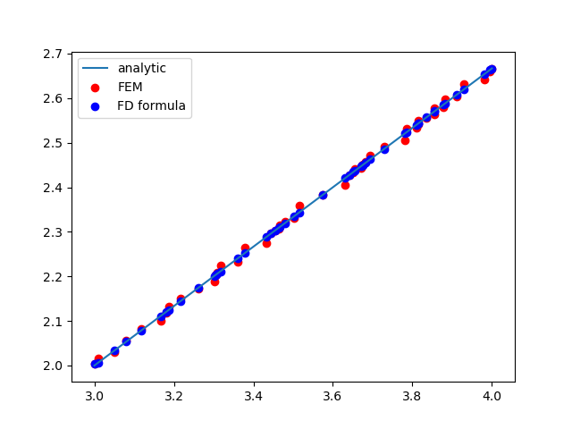

# Calculating the first derivative in one dimension: 
# Linear finite elements vs. higher-order finite-difference formula

In the TPMN lecture "Introduction to the Finite Element Method" (FEM), we have discussed basic principles of the FEM through simple one-dimensional (1D) examples. Referring to the 1D FEM code we discussed to calculate a function's first derivative, Prof. Alouani has pointed out an interesting finite-difference-based alternative to calculate the derivative of a function discretized on a 1D irregular grid. He sent me the following code snippet:

````python
def fd_derivative(nodes,N): # computes the FD derivative for random step
    deriv=np.zeros(N+1)
    for i in range(1,N):
        h1 = nodes[i+1] -nodes[i]
        h2 = nodes[i] -nodes[i-1]
        deriv[i] = (h2*h2 * my_test_function(nodes[i+1]) - h1*h1*my_test_function(nodes[i-1]) -
        (h2*h2 -h1*h1) * my_test_function(nodes[i])) / (h1*h2 * (h1+h2)) 
    deriv[0] = (my_test_function(nodes[1]) -my_test_function(nodes[0])) / (nodes[1] - nodes[0])
    deriv[N] = (my_test_function(nodes[N]) -my_test_function(nodes[N-1])) / (nodes[N] - nodes[N-1])
return deriv
```` 


As shown in the image below, this routine yields more accurate results for the first derivative than the FEM example code of the lecture.  
  



Let us first have a look at the finite-difference code. It employs an intricate and unusual formula to calculate the derivative `deriv[i]` at the points `i`, except for the outermost nodes where the first-order Gregory-Newton forward- and backward-difference forms are used. The underlying principle of this non-standard formulation for `deriv[i]` is not immediately clear. It is based on a higher-order Lagrangian interpolation according to an approach discussed, e.g., in this mathematical paper:

> A. K. Singh and B. S. Bhadauria  
> *Finite Difference Formulae for Unequal Sub-Intervals Using Lagrange's Interpolation Formula*  
> Int. Journal of Math. Analysis, Vol. 3, p. 815 (2009)  

The code implements __equation (8b)__ from that article. The PDF file of this paper can be found online.

I want to thank Prof. Alouani for sharing with me this alternative way of computing the derivative. Being aware of such recipes and comparing different numerical approximations can be helpful in Computational Physics. This finite-difference-based formula allows one to calculate the first derivative of a 1D function with irregular discretization, even though this is not possible within the framework of the usual FDM because the latter assumes a uniform grid spacing. 

Based on this example, one could be tempted to believe that the FEM (which is suited for treating cases with irregular discritazion) is inferior to finite-difference-based approaches. However, I wish to caution against comparing situations that are qualitatively different, and against jumping to conclusions about the quality of established numerical methods. With the following comments I attempt to clarify why.


* In the lecture, we have applied a simplified way to calculate the derivative with the FEM. We used a common and efficient approximation known as "*mass lumping*," which leads to the assembly through a weighted average over adjacent elements. We would obtain more accurate results through the so-called *weak derivative*, which we did not have the time to address. Calculating the weak derivative leads to a set of linear equations for the gradients at the nodes. The procedure is similar to the formalism with the stiffness matrix that we used in the second lecture when solving the Poisson equation.
 
* The lecture has discussed the calculation of the first derivative of a 1D function to demonstrate basic FEM principles by using a case that is as simple as possible. Studying such elementary situations is didactically helpful if they can be generalized to more realistic cases. More important than a high-accuracy solution of this specific example is that the same principles apply also in the much more relevant two- and three-dimensional cases - for any geometry and mesh size distribution.

* The higher-order finite-difference formula used in the routine shown above is tailored to address a situation that in the lecture was intended to be merely an example. This formula is very different from the one used in standard FDM. The lecture notes discuss how the usual first-derivative approximation of the FDM (i.e. the [symmetric derivative](https://en.wikipedia.org/wiki/Symmetric_derivative)) is recovered from the 1D linear FEM form as a special case when using homogeneous cell sizes.

* One can easily see why the finite-difference-based formula yields higher accuracy. Instead of combining difference quotients, it uses a polynomial interpolation involving three discretization points. The derivative is obtained by analytically differentiating the polynomial. Similar concepts also exist in the form of higher-order FEM formulations. We did not discuss them because this is an advanced and relatively marginal topic that lies outside the scope of an introductory lecture.

To summarize, the comparison of the accuracy discussed here concerns two different cases:  

1. an example deliberately kept simple to show a method's general principle, and   
2. a specialized higher-order formula tailored to treat that problem.

The different degree of accuracy of these two approaches is not relevant for a general comparison of the FEM and the FDM. The accuracy of the linear FEM can be improved if the mass-lumping approximation is not used. Moreover, the two approximations compared here are not of the same order. One should thus not draw general conclusions from this regarding the accuracy of the FDM or the FEM. Nevertheless, the higher-order finite-difference formula is a remarkable addition to the numerical treatment of this specific example, and it can be helpful to use such recipes in certain situations. 

## Addendum: Mass-lumping vs. weak derivative
A short test shows that calculating the weak derivative yields practically the same result as the mass-lumped calculation of the derivative discussed in the lecture.  


The accuracy improvement obtained from using the weak form is minimal compared to the simpler and faster mass-lumped approximation. Since the mass-lumping does not entail a significant loss of accuracy, higher-order interpolations are required to improve the precision noticeably. 

